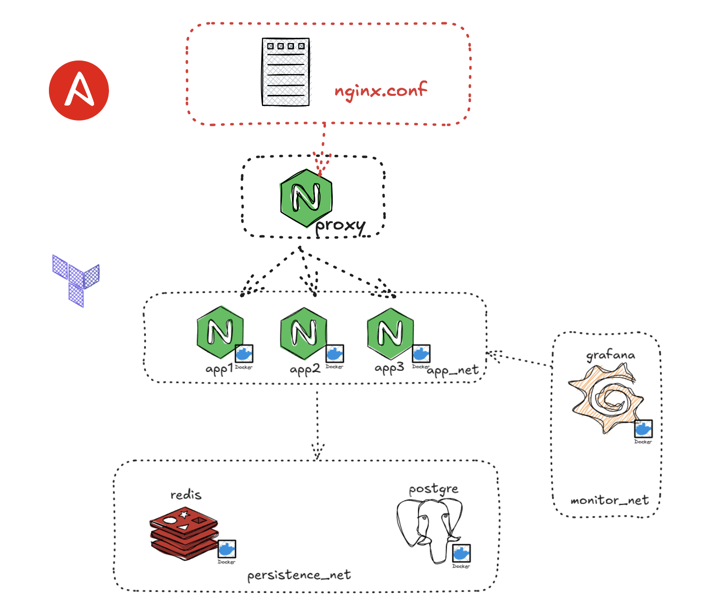

# Terraform Hands-on Lab

Con terraform habilitar un ambiente DEV con la siguiente configuración:


## Arquitectura

La infraestructura incluye:

- **Capa de aplicación**: 3 contenedores Nginx (app1, app2, app3)
- **Capa de persistencia**: PostgreSQL + Redis
- **Capa de monitoreo**: Grafana
- **Redes separadas**: `app_net`, `persistence_net`, `monitor_net`

## Requisitos previos

- Docker instalado y funcionando
- Terraform instalado
- Permisos para ejecutar Docker

## Clonar el repositorio

```bash
git clone git@github.com:jeancdevx/02-infraestructura.git
cd 02-infraestructura
```

## Despliegue

```bash
# Navegar al directorio de infraestructura
cd iac/

# Inicializar Terraform
terraform init

# Revisar el plan de despliegue
terraform plan

# Aplicar la infraestructura
terraform apply -auto-approve
```

## Verificación

```bash
curl http://localhost:8080
curl http://localhost:8081
curl http://localhost:8082
curl http://localhost:3000
```

## Servicios disponibles

| Servicio | URL | Credenciales |
|----------|-----|-------------|
| **App1** | http://localhost:8080 | - |
| **App2** | http://localhost:8081 | - |
| **App3** | http://localhost:8082 | - |
| **Grafana** | http://localhost:3000 | admin/admin |
| **PostgreSQL** | localhost:5432 | example/example |
| **Redis** | localhost:6379 | - |

## Limpieza

```bash
# Destruir la infraestructura
terraform destroy -auto-approve
```